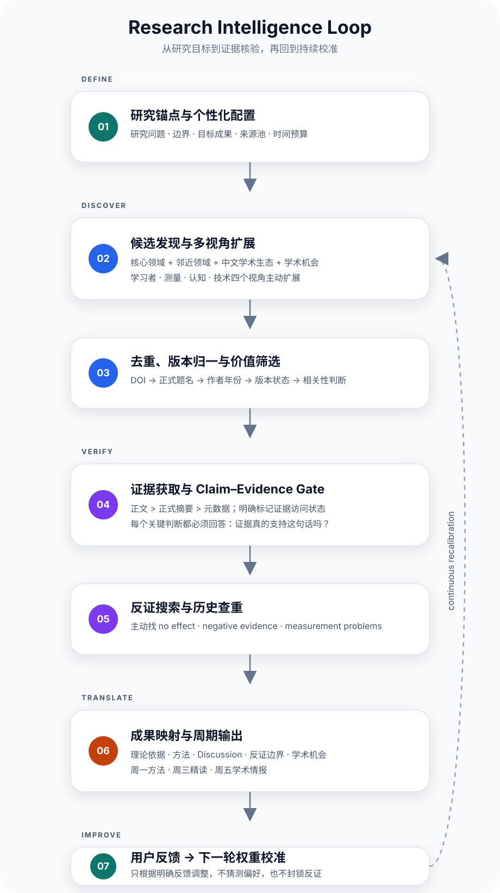

<div align="center">

# **Research Growth & Academic Intelligence System**

### **把“搜论文”升级成一套长期运行的研究成长与学术情报系统**

**证据核验 · 反证搜索 · 成果映射 · 个性化校准**

[](CHANGELOG.md)
[](LICENSE)

</div>

> **这套系统的目标不是让你“每周多读几篇论文”，而是把有限的阅读时间持续转化为研究判断、方法能力、论文素材与学术机会。**

> **公开版隐私提示：**不要提交真实邮箱、未公开研究细节、账号凭据、参与者数据、私人任务 ID 或本地配置。

> ### **第一次使用？不要先改 Prompt。**
> **→ [点这里看 00｜零基础配置指南](00_BEGINNER_SETUP.md)**  
> 它会教你让 ChatGPT **一次只问一个问题 → 自动生成个性化配置 → 自动填好模板 → 创建任务**。

---

## **01｜它解决什么问题？**

很多 AI 学术工作流最后都会退化成：**搜索 → 摘要 → 推荐**。

这套系统专门处理更长期的六个问题：

1. **信息太多，真正值得读的太少**：先建立候选池，再去重、筛选、核验证据，只保留少量高价值内容。
2. **长期追踪容易形成信息茧房**：固定加入反证、方法挑战和 `Outside the thesis` 视角。
3. **读了很多论文，却没有形成研究能力**：把一周拆成“方法学习—论文精读—学术情报”，避免三次都只是摘要。
4. **新论文不断出现，研究方案容易被带着跑**：设置“研究变化闸门”，只有新证据真正挑战操作化、测量、编码或解释边界时才建议复核。
5. **收藏越来越多，却难以转化为成果**：把重要材料映射到“理论依据、研究缺口、操作化、编码方法、分析方法、Discussion、反证/边界”等用途。
6. **AI 容易把“找到”误写成“读过”，把“相关”误写成“证据”**：使用 Evidence Status 与 Claim–Evidence Gate，强制说明证据访问状态与结论边界。

---

## **02｜核心工作流**

<p align="center">
  
</p>

**默认逻辑：**

> **研究锚点 → 候选发现 → 多视角扩展 → 去重归一 → 价值筛选 → 证据获取 → Claim–Evidence Gate → 反证搜索 → 历史查重 → 成果映射 → 周期输出 → 用户反馈 → 下一轮校准**

### **默认一周三次运行**

| 时间 | 模块 | 目标 |
|---|---|---|
| **周一｜方法与能力** | 只学 1 个方法、统计、AI 或数据能力 | 建立可迁移研究能力 |
| **周三｜研究与发表精读** | 只拆 1 篇论文 | 回答“为什么它能独立成文” |
| **周五｜学术情报周报** | 最新研究 + 中文学术生态 + 会议/征稿 + 反证 + 跨界信息 | 保持研究判断与学术视野 |

---

## **03｜最适合的使用场景**

- **硕士论文已经基本确定**：希望边完成论文，边积累可独立发表的材料。
- **正在准备申博**：需要持续积累研究方法、学术生态和研究方向判断。
- **研究领域变化快**：例如 AI、教育、语言学、社会科学、HCI、NLP。
- **同时追踪中英文资料**：论文、期刊动态、会议、CFP、Special Issue。
- **不想被 AI 每周机械推荐“相似论文”**：希望获得少量、可核验、可行动、不过度重复的学术情报。
- **已有固定研究方案**：希望系统能区分“值得关注”和“必须改研究设计”。

---

## **04｜这套系统的长期价值**

它不是让你“读更多”，而是逐步积累三类资产：

- **知识资产**：哪些研究真正改变了你的判断。
- **方法资产**：哪些方法、统计和工具值得反复使用。
- **成果资产**：哪些文献和证据可以进入未来论文的具体位置。

长期运行后，理想状态不是邮箱里堆满周报，而是形成：

**当前论文素材池 / 后续论文素材池 / 方法与测量素材池 / 目标期刊与会议池 / 反证与研究边界池 / 博士与职业能力增长记录**

---

## **05｜设计上借鉴了哪些公开成果？**

本项目**没有复制这些项目的代码**，而是借鉴其公开工作流思想：

- **Future-House / PaperQA2**：检索 → 证据 → 回答；强调元数据、全文证据与引用支撑。
- **Stanford STORM / Co-STORM**：多视角提问，主动发现遗漏问题，避免单一关键词锁死搜索边界。
- **ArxivDigest**：根据研究兴趣做个性化相关性排序，而不是按发布时间机械推送。
- **paper-search-mcp**：多来源发现、去重、来源能力透明化，区分“发现源”和“全文/证据源”。
- **ASReview**：把研究者的明确反馈作为后续筛选校准信号。
- **Academic Research Skills**：human-in-the-loop、证据溯源、claim integrity gate 与质量检查。
- **Awesome AI Literature Review**：把文献工作拆成 search → screen → extract → read → synthesize → cite-check 等阶段。

详见 [`08_DESIGN_REFERENCES.md`](08_DESIGN_REFERENCES.md) 与 [`THIRD_PARTY_NOTICES.md`](THIRD_PARTY_NOTICES.md)。

---

## **06｜怎么个性化？新手不需要手工改 Prompt**

如果你是第一次使用，**不要直接打开 9000 字模板逐个找 `{{...}}` 替换**。

最推荐的方法是：

> **让 ChatGPT 先采访你 → 生成配置摘要 → 你确认 → AI 自动填好模板。**

### **最省事的方式**

直接把下面这段发给 ChatGPT：

```text
我想使用“Research Growth & Academic Intelligence System”。

请不要立刻生成最终提示词。
请像做访谈一样帮我完成个性化配置，一次只问我一个问题。

你需要问清楚：
1. 我现在是什么阶段；
2. 当前最重要的研究/学习任务；
3. 当前研究题目或核心问题；
4. 哪些研究设计已经基本确定；
5. 未来可能形成哪些独立成果；
6. 最想追踪哪些中文和英文来源；
7. 最担心形成哪种信息茧房；
8. 最想补哪些方法、统计、AI或数据能力；
9. 每周能投入多少时间；
10. 希望通过什么方式收到结果。

如果我不知道怎么回答，请给我2—3个简单例子。
不要替我编造研究信息。

全部问完后：
A. 先给我“个性化配置摘要”确认；
B. 我确认后，再把这些信息自动填入
   03_CHATGPT_AUTOMATION_PROMPT_TEMPLATE.md；
C. 检查是否还残留任何 {{...}}；
D. 最后输出可直接创建 Scheduled Task 的最终提示词。
```

完整的零基础教程见：

### **→ [00_BEGINNER_SETUP.md｜零基础配置指南](00_BEGINNER_SETUP.md)**

### **什么叫“替换占位符”？**

例如模板里写：

```text
当前研究主题：
{{当前研究题目/问题}}
```

如果你的研究是：

```text
大学生使用生成式人工智能写作反馈的采纳行为
```

最终就变成：

```text
当前研究主题：
大学生使用生成式人工智能写作反馈的采纳行为
```

`{{...}}` 只是“这里需要填你自己的信息”的标记，**最终 Prompt 里不应该再留下这些占位符**。

### **哪些内容要改，哪些不要改？**

**必须改成你自己的：**

- 研究题目 / 核心问题
- 已经稳定的研究边界
- 后续成果方向
- 中文 / 英文来源池
- 方法与技能学习方向
- 时间预算
- 推送方式

**新手建议先不要动：**

- Claim–Evidence Gate
- Contradiction Search
- 去重规则
- Evidence Status
- Outside the thesis
- 每月信息覆盖审计
- “相关 ≠ 因果”
- “找到论文 ≠ 读过全文”
- “宁缺毋滥”

这些是系统的核心骨架。

---

## **07｜怎么使用？**

### **ChatGPT 用户｜推荐新手路线**

最简单只需要 4 步：

**第 1 步：让 ChatGPT 采访你**

按照 [`00_BEGINNER_SETUP.md`](00_BEGINNER_SETUP.md) 中的“逐问逐答”提示词，让 ChatGPT 一次只问一个问题。

**第 2 步：让 ChatGPT 自动生成最终 Prompt**

你不需要自己修改模板。让 AI 根据你的回答自动填写 [`03_CHATGPT_AUTOMATION_PROMPT_TEMPLATE.md`](03_CHATGPT_AUTOMATION_PROMPT_TEMPLATE.md)，并检查所有 `{{...}}` 是否已经处理。

如果你喜欢自己填写，也可以先完成 [`04_PERSONALIZATION_WORKSHEET.md`](04_PERSONALIZATION_WORKSHEET.md)，再把它和模板一起交给 ChatGPT。

**第 3 步：创建 Scheduled Task**

拿到最终 Prompt 后，直接告诉 ChatGPT：

```text
请基于这份最终提示词创建自动任务。

周一运行“方法与能力”；
周三运行“研究与发表精读”；
周五运行“学术情报周报”。

运行时间：周一、周三、周五 19:00。
时区：Asia/Shanghai。

如果当前账号不支持直接创建，请不要假装创建成功，
而是告诉我应该在哪里设置。
```

时间和时区当然可以改成你自己的。

**第 4 步：先运行，再优化**

不要第一天就反复改 Prompt。

先运行 **2–4 周**，再用 [`07_GATE6_AUDIT_PROTOCOL.md`](07_GATE6_AUDIT_PROTOCOL.md) 检查：

- 有没有重复；
- 有没有把摘要当全文；
- 中文来源是否真的覆盖；
- 是否形成信息茧房；
- 输出是否太长；
- 是否真正帮助你的研究。

更短的部署说明见 [`02_QUICK_START_CHATGPT.md`](02_QUICK_START_CHATGPT.md)。

### **WorkBuddy / 深度研究代理**

如果你的工具擅长长时间网页检索、批量处理文献或数据库浏览，建议拆成三层：

- **核心协议**：证据规则、去重、反证、信息茧房控制。
- **个人配置**：研究主题、目标期刊、关键词、成果池。
- **运行任务**：本周检索、单篇精读、专项数据库盘点。

适合把**周五学术情报**交给深度研究代理；周一方法学习和周三精读可保留为轻量任务。若平台不能可靠定时运行，就改成固定日期手动触发。

### **Codex / Skill 用户**

仓库包含可复用的 `skill/` 起点：

```text
skill/
├── SKILL.md
├── references/
│   ├── PERSONALIZATION_SCHEMA.md
│   └── SOURCE_POLICY.md
└── templates/
    └── OUTPUT_TEMPLATES.md
```

**Skill 定义工作流，不等于定时调度器。** 不同 ChatGPT、Codex、API 或其他 Agent 环境中的安装方式和支持范围可能不同，请以各平台当前能力为准。

### **其他 AI 用户**

如果你的 AI 不支持 Scheduled Task 或 Skill：

- 把 [`03_CHATGPT_AUTOMATION_PROMPT_TEMPLATE.md`](03_CHATGPT_AUTOMATION_PROMPT_TEMPLATE.md) 当作系统/项目提示词；
- 把 [`04_PERSONALIZATION_WORKSHEET.md`](04_PERSONALIZATION_WORKSHEET.md) 当作个人配置；
- 每周手动运行“周一 / 周三 / 周五模式”；
- 如果平台支持定时器、工作流或 Agent，再接入自动调度。

真正需要保留的不是某个模型，而是这些机制：

> **来源覆盖透明 / 发现源与证据源分离 / Claim–Evidence Gate / 反证搜索 / 去重 / 成果映射 / 用户反馈校准 / 信息茧房审计**

---

## **08｜仓库导航**

| 文件 | 用途 |
|---|---|
| [`00_BEGINNER_SETUP.md`](00_BEGINNER_SETUP.md) | **零基础用户：从这里开始，不需要手工改 Prompt** |
| [`START_HERE.md`](START_HERE.md) | 项目完整介绍 |
| [`01_INTRODUCTION_FOR_SHARING.md`](01_INTRODUCTION_FOR_SHARING.md) | 可直接分享的项目介绍 |
| [`02_QUICK_START_CHATGPT.md`](02_QUICK_START_CHATGPT.md) | ChatGPT 快速部署 |
| [`03_CHATGPT_AUTOMATION_PROMPT_TEMPLATE.md`](03_CHATGPT_AUTOMATION_PROMPT_TEMPLATE.md) | 通用自动任务模板 |
| [`04_PERSONALIZATION_WORKSHEET.md`](04_PERSONALIZATION_WORKSHEET.md) | 个性化配置表 |
| [`05_SOURCE_AND_EVIDENCE_POLICY.md`](05_SOURCE_AND_EVIDENCE_POLICY.md) | 来源与证据规则 |
| [`06_CROSS_PLATFORM_ADAPTATION.md`](06_CROSS_PLATFORM_ADAPTATION.md) | 跨平台使用指南 |
| [`07_GATE6_AUDIT_PROTOCOL.md`](07_GATE6_AUDIT_PROTOCOL.md) | 2–4 周运行审计 |
| [`08_DESIGN_REFERENCES.md`](08_DESIGN_REFERENCES.md) | 设计参考 |
| [`09_PRIVACY_BEFORE_SHARING.md`](09_PRIVACY_BEFORE_SHARING.md) | 隐私发布检查 |
| [`skill/`](skill/) | Skill 化起点 |

---

## **09｜能力边界**

这是一套**学术情报与研究成长工作流模板**，不是数据库，也不保证检索覆盖完整。

默认周报**不等同于系统综述、范围综述或元分析**。若需要开展可发表的系统综述，应另外定义检索式、数据库范围、纳排标准、筛选记录、去重规则与报告规范。AI 生成的判断仍需要研究者承担最终核验责任。

本项目与 OpenAI、GitHub、CNKI、PaperQA2、STORM、ASReview、ArxivDigest、Academic Research Skills 及其他被引用项目**不存在官方隶属、认证或合作关系**，除非未来仓库另有明确说明。

---

## **10｜License**

除非文件另有说明，本仓库原创文档、提示词、模板和 Skill 指令采用 **CC BY 4.0**。详见 [`LICENSE`](LICENSE) 和 [`ATTRIBUTION.md`](ATTRIBUTION.md)。第三方名称、商标、链接资源和上游材料仍受其各自权利与许可证约束，详见 [`THIRD_PARTY_NOTICES.md`](THIRD_PARTY_NOTICES.md)。

---

## **11｜贡献与反馈**

如果你发现：证据规则不够严谨、某个平台的部署方式已变化、来源池值得补充、某种运行场景会导致重复/幻觉/信息茧房，或你有更好的周报结构、审计机制与 Skill 组织方式，欢迎提交 Issue 或 Pull Request。

详见 [`CONTRIBUTING.md`](CONTRIBUTING.md)。

### **欢迎使用者们不断提出意见，我们一起完善这个 Skill 或提示词。**
